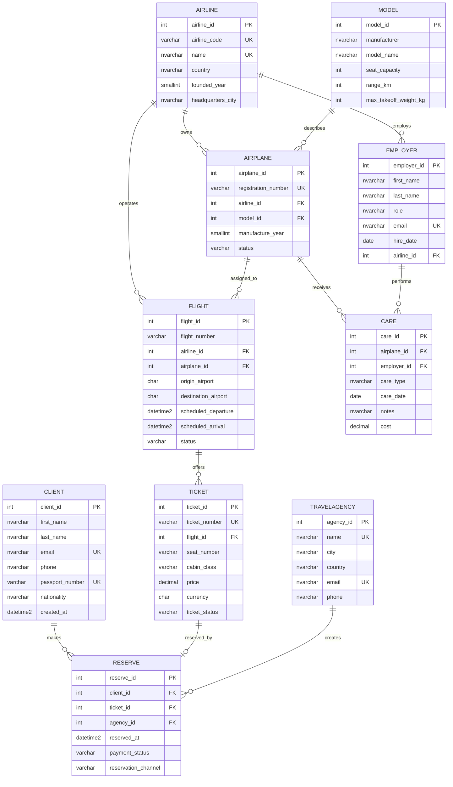

# Airport Management System ER Design

## Purpose

This document defines the relational design that will be implemented in SQL Server during Phase 2. It preserves the original airport management entities while tightening names, constraints, and relationships so the database can be populated, migrated, and validated reliably.

## Entity Summary

| Entity | Purpose |
| --- | --- |
| AIRLINE | Commercial airline operating flights and owning airplanes. |
| MODEL | Aircraft model metadata such as manufacturer, capacity, and range. |
| AIRPLANE | Physical airplane assigned to one airline and one model. |
| FLIGHT | Scheduled flight operated by one airline and usually assigned to one airplane. |
| CLIENT | Passenger/customer that can reserve tickets. |
| EMPLOYER | Airport or airline staff member. The original name is retained for project compatibility. |
| TRAVELAGENCY | Agency that can create reservations for clients. |
| TICKET | Sellable ticket for one flight. |
| RESERVE | Reservation linking a client, ticket, and optional travel agency. |
| CARE | Maintenance/service event linking an employer and an airplane. |

## Proposed Relational Schema

### AIRLINE

| Column | Type | Constraints |
| --- | --- | --- |
| airline_id | INT | Primary key, identity |
| airline_code | VARCHAR(8) | Not null, unique |
| name | NVARCHAR(120) | Not null, unique |
| country | NVARCHAR(80) | Not null |
| founded_year | SMALLINT | Null, check between 1900 and current year |
| headquarters_city | NVARCHAR(100) | Null |

### MODEL

| Column | Type | Constraints |
| --- | --- | --- |
| model_id | INT | Primary key, identity |
| manufacturer | NVARCHAR(100) | Not null |
| model_name | NVARCHAR(100) | Not null |
| seat_capacity | INT | Not null, check greater than 0 |
| range_km | INT | Not null, check greater than 0 |
| max_takeoff_weight_kg | INT | Null, check greater than 0 when present |

Unique constraint: `(manufacturer, model_name)`.

### AIRPLANE

| Column | Type | Constraints |
| --- | --- | --- |
| airplane_id | INT | Primary key, identity |
| registration_number | VARCHAR(20) | Not null, unique |
| airline_id | INT | Not null, foreign key to AIRLINE |
| model_id | INT | Not null, foreign key to MODEL |
| manufacture_year | SMALLINT | Not null, check between 1960 and current year |
| status | VARCHAR(20) | Not null, check in `ACTIVE`, `MAINTENANCE`, `RETIRED` |

### FLIGHT

| Column | Type | Constraints |
| --- | --- | --- |
| flight_id | INT | Primary key, identity |
| flight_number | VARCHAR(16) | Not null |
| airline_id | INT | Not null, foreign key to AIRLINE |
| airplane_id | INT | Null, foreign key to AIRPLANE |
| origin_airport | CHAR(3) | Not null |
| destination_airport | CHAR(3) | Not null |
| scheduled_departure | DATETIME2 | Not null |
| scheduled_arrival | DATETIME2 | Not null |
| status | VARCHAR(20) | Not null, check in `SCHEDULED`, `DELAYED`, `CANCELLED`, `COMPLETED` |

Constraints:

- Unique `(airline_id, flight_number, scheduled_departure)`.
- Check `origin_airport <> destination_airport`.
- Check `scheduled_arrival > scheduled_departure`.

### CLIENT

| Column | Type | Constraints |
| --- | --- | --- |
| client_id | INT | Primary key, identity |
| first_name | NVARCHAR(80) | Not null |
| last_name | NVARCHAR(80) | Not null |
| email | NVARCHAR(255) | Not null, unique |
| phone | NVARCHAR(40) | Null |
| passport_number | VARCHAR(30) | Not null, unique |
| nationality | NVARCHAR(80) | Not null |
| created_at | DATETIME2 | Not null, default current UTC timestamp |

### EMPLOYER

| Column | Type | Constraints |
| --- | --- | --- |
| employer_id | INT | Primary key, identity |
| first_name | NVARCHAR(80) | Not null |
| last_name | NVARCHAR(80) | Not null |
| role | NVARCHAR(80) | Not null |
| email | NVARCHAR(255) | Not null, unique |
| hire_date | DATE | Not null |
| airline_id | INT | Null, foreign key to AIRLINE |

### TRAVELAGENCY

| Column | Type | Constraints |
| --- | --- | --- |
| agency_id | INT | Primary key, identity |
| name | NVARCHAR(150) | Not null, unique |
| city | NVARCHAR(100) | Not null |
| country | NVARCHAR(80) | Not null |
| email | NVARCHAR(255) | Not null, unique |
| phone | NVARCHAR(40) | Null |

### TICKET

| Column | Type | Constraints |
| --- | --- | --- |
| ticket_id | INT | Primary key, identity |
| ticket_number | VARCHAR(30) | Not null, unique |
| flight_id | INT | Not null, foreign key to FLIGHT |
| seat_number | VARCHAR(8) | Not null |
| cabin_class | VARCHAR(20) | Not null, check in `ECONOMY`, `PREMIUM_ECONOMY`, `BUSINESS`, `FIRST` |
| price | DECIMAL(10,2) | Not null, check greater than or equal to 0 |
| currency | CHAR(3) | Not null, default `USD` |
| ticket_status | VARCHAR(20) | Not null, check in `AVAILABLE`, `RESERVED`, `CANCELLED`, `USED` |

Unique constraint: `(flight_id, seat_number)`.

### RESERVE

| Column | Type | Constraints |
| --- | --- | --- |
| reserve_id | INT | Primary key, identity |
| client_id | INT | Not null, foreign key to CLIENT |
| ticket_id | INT | Not null, unique, foreign key to TICKET |
| agency_id | INT | Null, foreign key to TRAVELAGENCY |
| reserved_at | DATETIME2 | Not null |
| payment_status | VARCHAR(20) | Not null, check in `PENDING`, `PAID`, `REFUNDED`, `FAILED` |
| reservation_channel | VARCHAR(20) | Not null, check in `DIRECT`, `AGENCY`, `MOBILE`, `WEB` |

The unique constraint on `ticket_id` prevents the same ticket from being reserved more than once.

### CARE

| Column | Type | Constraints |
| --- | --- | --- |
| care_id | INT | Primary key, identity |
| airplane_id | INT | Not null, foreign key to AIRPLANE |
| employer_id | INT | Not null, foreign key to EMPLOYER |
| care_type | NVARCHAR(80) | Not null |
| care_date | DATE | Not null |
| notes | NVARCHAR(500) | Null |
| cost | DECIMAL(10,2) | Not null, check greater than or equal to 0 |

## Relationship Cardinalities

| Relationship | Cardinality |
| --- | --- |
| AIRLINE to AIRPLANE | One airline owns many airplanes. |
| MODEL to AIRPLANE | One model describes many airplanes. |
| AIRLINE to FLIGHT | One airline operates many flights. |
| AIRPLANE to FLIGHT | One airplane can be assigned to many flights; a flight may temporarily have no airplane. |
| FLIGHT to TICKET | One flight has many tickets. |
| CLIENT to RESERVE | One client can make many reservations. |
| TICKET to RESERVE | One ticket can have zero or one reservation. |
| TRAVELAGENCY to RESERVE | One agency can create many reservations; reservations may be direct with no agency. |
| AIRPLANE to CARE | One airplane can have many maintenance records. |
| EMPLOYER to CARE | One employer can perform many maintenance events. |
| AIRLINE to EMPLOYER | One airline can employ many staff; some staff may be airport-level and not tied to an airline. |

## Mermaid ER Diagram

## Design Notes

- The original entity names are retained for project traceability, including `EMPLOYER` and `CARE`.
- `RESERVE` is modeled as a reservation transaction rather than a many-to-many join only, because it has business attributes such as payment status, channel, and timestamp.
- `TICKET.ticket_status` allows seed data to represent available tickets as well as reserved tickets.
- `FLIGHT.airplane_id` is nullable to support real airline scheduling where aircraft assignment may happen after flight creation.
- SQL Server check constraints will enforce domain rules before data reaches MongoDB.
